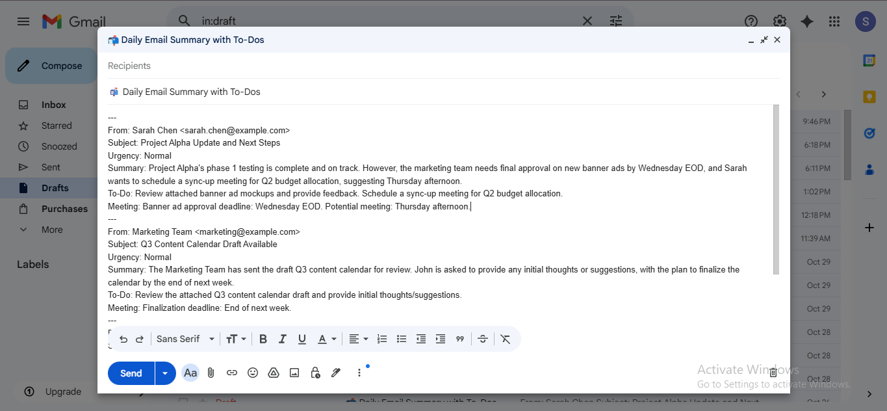
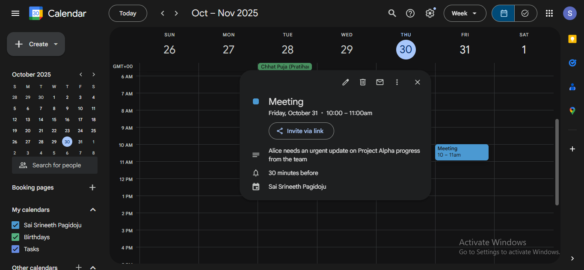

<h1>📧 Email Summarizer Automation (Gmail + Telegram + Calendar)</h1>

<blockquote><b>Automate your email workflow with AI.</b> 
A powerful n8n automation that summarizes daily Gmail messages using <b>Google Gemini</b>, extracts To-Dos, detects urgency, schedules calendar meetings, and sends instant Telegram alerts — keeping your day fully organized.
</blockquote>

<h2>🧠 Overview</h2>

<b>Email Summarizer Automation</b> is an AI-driven workflow that streamlines email management and task tracking.  
Every day, it automatically:

<ul>
  <li>📨 Fetches your latest Gmail emails</li>
  <li>🤖 Summarizes content using <b>Google Gemini (LangChain)</b></li>
  <li>🚦 Detects <b>urgency levels</b> (High / Normal / Low)</li>
  <li>✅ Extracts <b>actionable To-Dos</b></li>
  <li>📅 Creates <b>Google Calendar meetings</b> from detected events</li>
  <li>💬 Sends <b>urgent alerts via Telegram</b></li>
  <li>💌 Compiles a <b>Gmail draft summary</b> for review</li>
</ul>

This project eliminates manual inbox triage and ensures you <b>never miss a meeting, task, or important message</b>.

<h2>⚙️ Workflow Architecture</h2>

<h3>🔹 High-Level Flow</h3>
<pre>
[Schedule Trigger]
      │
      ▼
[Get Emails] → [Prepare Email Data] → [AI Summarizer (Gemini)]
      ├──► [Filter for Telegram Alerts] → [Send Telegram Alert]
      ├──► [Extract To-Dos] → [Format To-Do HTML] → [Send Gmail Message]
      ├──► [Calendar Event Details] → [Create Google Calendar Event]
      └──► [Split in Batches] → [Combine Summaries] → [Create Gmail Draft]
</pre>

<h2>🏗️ System Architecture</h2>

The <b>Email Summarizer Automation</b> workflow follows a modular, event-driven architecture built entirely in <b>n8n</b>.
Each component (node) performs a distinct role in collecting, processing, and distributing email insights.

<h3>🔹 Architectural Overview</h3>

This automation is designed as a <b>multi-branch workflow</b> that begins with a scheduled trigger and fans out into four major functional paths:

<ul>
  <li><b>1️⃣ AI Summarization Path</b> — Generates concise summaries for each email using Google Gemini.</li>
  <li><b>2️⃣ Task Extraction Path</b> — Detects and formats actionable To-Dos as a daily checklist.</li>
  <li><b>3️⃣ Urgency Alert Path</b> — Filters high-priority messages and delivers instant Telegram notifications.</li>
  <li><b>4️⃣ Calendar Scheduling Path</b> — Parses date/time mentions and creates Google Calendar events automatically.</li>
</ul>

<h3>🧠 Data Flow Diagram (Simplified)</h3>

<pre>
          ┌──────────────────────┐
          │   Schedule Trigger   │
          └──────────┬───────────┘
                     │
                     ▼
            ┌────────────────┐
            │   Get Emails   │
            └───────┬────────┘
                    │
                    ▼
        ┌────────────────────────┐
        │  Prepare Email Data     │
        └────────┬───────────────┘
                 │
                 ▼
        ┌────────────────────────┐
        │  AI Summarizer (Gemini)│
        └──┬────────┬────────┬───┘
           │        │        │
           │        │        │
           ▼        ▼        ▼
  ┌────────────┐ ┌────────────┐ ┌──────────────────┐
  │  To-Do Path│ │Alert Filter│ │Calendar Detector │
  └────┬───────┘ └────┬───────┘ └──────┬───────────┘
       │              │                │
       ▼              ▼                ▼
┌────────────┐  ┌──────────────┐  ┌────────────────┐
│Format HTML │  │Send Telegram │  │Create Calendar │
│To-Do Email │  │Alert         │  │Event           │
└────┬───────┘  └──────────────┘  └────────────────┘
     │
     ▼
┌─────────────────────────────┐
│Combine Summaries → Gmail Draft│
└─────────────────────────────┘
</pre>

<h3>🔹 Component Layers</h3>

<h4>🧩 1. Input Layer</h4>
<ul>
  <li><b>Schedule Trigger:</b> Starts the workflow automatically based on configured intervals (daily/hourly).</li>
  <li><b>Gmail Fetch Node:</b> Retrieves new emails from your inbox using Gmail API filters (e.g., <code>newer_than:1d</code>).</li>
</ul>

<h4>🤖 2. Processing Layer</h4>
<ul>
  <li><b>Code (Prepare Email Data):</b> Cleans raw Gmail metadata (sender, subject, snippet).</li>
  <li><b>AI Summarizer (Gemini):</b> Uses natural-language processing to summarize, detect urgency, and identify tasks or meetings.</li>
</ul>

<h4>⚙️ 3. Logic Layer</h4>
<ul>
  <li><b>Filter for Telegram Alerts:</b> Selects only “High-Urgency” summaries for real-time alerts.</li>
  <li><b>Extract To-Dos:</b> Collects all actionable items and formats them as structured tasks.</li>
  <li><b>Calendar Event Details:</b> Detects any date/time and prepares meeting event objects.</li>
</ul>

<h4>📤 4. Output Layer</h4>
<ul>
  <li><b>Gmail Draft & Email:</b> Sends a formatted summary and daily task checklist.</li>
  <li><b>Google Calendar:</b> Adds auto-scheduled events based on email mentions.</li>
  <li><b>Telegram:</b> Sends instant high-priority notifications to your mobile chat.</li>
</ul>

<h4>🛡️ 5. Safety & Control Layer</h4>
<ul>
  <li><b>Limit Node:</b> Restricts maximum emails processed per run (default: 10).</li>
  <li><b>Split in Batches:</b> Processes emails sequentially to prevent API overload.</li>
  <li><b>Error Isolation:</b> Non-critical paths (e.g., alerts, drafts) run independently.</li>
</ul>

<h3>📦 Data Flow Summary</h3>

<table>
  <tr><th>Stage</th><th>Input</th><th>Output</th></tr>
  <tr><td><b>Input</b></td><td>Gmail API (email data)</td><td>Parsed email content</td></tr>
  <tr><td><b>Processing</b></td><td>Email text, metadata</td><td>Summarized, structured JSON</td></tr>
  <tr><td><b>Logic</b></td><td>AI output JSON</td><td>To-Dos, Urgency, Meeting metadata</td></tr>
  <tr><td><b>Output</b></td><td>Processed summaries</td><td>Telegram Alerts, Gmail Drafts, Calendar Events</td></tr>
</table>

<h3>📡 Key Integrations</h3>
<ul>
  <li>🔗 <b>Google Gemini (LangChain):</b> for natural language summarization.</li>
  <li>📬 <b>Gmail API:</b> for fetching messages and sending formatted outputs.</li>
  <li>🗓️ <b>Google Calendar API:</b> for automated event scheduling.</li>
  <li>💬 <b>Telegram Bot API:</b> for instant alert delivery.</li>
</ul>

<h3>🧭 Design Highlights</h3>
<ul>
  <li>✅ <b>Parallel Processing:</b> AI, alerts, and calendar paths run concurrently for speed.</li>
  <li>✅ <b>Fault Isolation:</b> Failure in one branch doesn’t interrupt others.</li>
  <li>✅ <b>Dynamic Scheduling:</b> Automatically shifts event creation to next working slot if current time exceeds threshold.</li>
  <li>✅ <b>Human-Readable Output:</b> All summaries and lists are generated in natural language for quick understanding.</li>
</ul>

<h3>🧩 Architectural Advantages</h3>
<ul>
  <li>📈 Scalable modular flow with easily replaceable nodes.</li>
  <li>🔒 Secure credential handling via n8n’s encrypted credential manager.</li>
  <li>⏱️ Time-efficient — end-to-end execution completes within minutes.</li>
  <li>🤝 Integrates seamlessly with external tools like Notion, Sheets, or Slack (for future expansion).</li>
</ul>

<h3>🔹 Core Functionality</h3>
<table>
  <tr><th>Module</th><th>Description</th></tr>
  <tr><td><b>AI Summarizer (Gemini)</b></td><td>Summarizes emails, detects urgency, finds meetings & actions</td></tr>
  <tr><td><b>To-Do Extractor</b></td><td>Identifies actionable tasks and converts them into checklist items</td></tr>
  <tr><td><b>Telegram Alert Filter</b></td><td>Triggers immediate alerts for High-urgency mails</td></tr>
  <tr><td><b>Calendar Node</b></td><td>Automatically creates meetings based on detected time references</td></tr>
  <tr><td><b>Gmail Output Nodes</b></td><td>Sends formatted To-Do list and creates daily draft summaries</td></tr>
</table>

<h2>🧩 Visual Workflow</h2>
<!-- Replace these image links with your own repo image paths -->

<h3>🧠 Workflow Snapshot</h3>

<h3>📬 Gmail Draft Summary</h3>

<h3>📝 To-Do Mail Output</h3>

<h3>📅 Calendar Event</h3>

<h3>🔔 Telegram Alerts</h3>

<!-- 💡 Optional: Add demo video -->
<!-- 
<a href="https://youtu.be/your-demo-link">🎥 Watch Demo Video</a>
 -->

<h2>🧪 Example Outputs</h2>

<h3>✉️ Gmail Summary (AI Generated)</h3>

<b>From:</b> Sarah Chen 
<b>Subject:</b> Project Alpha Update and Next Steps 
<b>Urgency:</b> Normal 
<b>Summary:</b> Phase 1 testing complete. Awaiting feedback on marketing assets. 
<b>To-Do:</b> Review creative mockups and confirm meeting date. 
<b>Meeting:</b> Thursday, 3 PM

<h3>🗒️ To-Do List Email</h3>

<b>Subject:</b> 📝 Today’s High-Priority Tasks

<pre>
☐ ⚡ Confirm meeting availability for Tuesday
☐ Reply to Bob with final lunch details
☐ Review vendor proposal by EOD
☐ Approve creative banner designs
</pre>

<h3>📅 Google Calendar Event</h3>

<b>Title:</b> Project Alpha Progress Review 
🕒 Time: Tomorrow 10:00 AM – 11:00 AM 
📋 Description: Weekly sync to finalize milestone status.

<h3>💬 Telegram Alert</h3>
<blockquote>
<b>From:</b> Sarah Chen 
<b>Subject:</b> URGENT — Project Phoenix Blocker 
<b>Summary:</b> Critical bug in Module B. Emergency meeting scheduled at 3 PM.
</blockquote>

<h2>🧩 Nodes and Responsibilities</h2>

<table>
  <tr>
    <th>Node</th>
    <th>Responsibilities</th>
  </tr>

  <tr>
    <td><b>1️⃣ Schedule Trigger</b></td>
    <td>
      <ul>
        <li>Initiates the workflow automatically at defined intervals (e.g., hourly or daily).</li>
        <li>Ensures your emails are processed consistently without manual execution.</li>
        <li>Acts as the entry point for the entire automation pipeline.</li>
      </ul>
    </td>
  </tr>

  <tr>
    <td><b>2️⃣ Get Emails (Gmail Node)</b></td>
    <td>
      <ul>
        <li>Fetches the most recent Gmail messages using the Gmail API.</li>
        <li>Filters emails newer than a specific period (e.g., “newer_than:1d”).</li>
        <li>Limits the total emails fetched per run for safety and rate-limit control.</li>
      </ul>
    </td>
  </tr>

  <tr>
    <td><b>3️⃣ Prepare Email Data (Code Node)</b></td>
    <td>
      <ul>
        <li>Extracts structured fields such as sender, subject, and snippet from each email.</li>
        <li>Normalizes headers for consistent downstream processing.</li>
        <li>Marks presence of attachments and default urgency level.</li>
      </ul>
    </td>
  </tr>

  <tr>
    <td><b>4️⃣ AI Summarizer (LangChain + Gemini)</b></td>
    <td>
      <ul>
        <li>Processes each email using Google Gemini via LangChain’s agent node.</li>
        <li>Generates concise 2–3 line summaries per mail.</li>
        <li>Detects urgency, actionable items, and potential meeting/event details.</li>
      </ul>
    </td>
  </tr>

  <tr>
    <td><b>5️⃣ Extract To-Dos (Code Node)</b></td>
    <td>
      <ul>
        <li>Parses AI output to identify actionable tasks marked under “To-Do”.</li>
        <li>Creates structured task objects containing sender and subject context.</li>
        <li>Assigns priority based on detected urgency (e.g., High → Priority 4).</li>
      </ul>
    </td>
  </tr>

  <tr>
    <td><b>6️⃣ Filter for Telegram Alerts</b></td>
    <td>
      <ul>
        <li>Scans summaries for “High Urgency” markers.</li>
        <li>Bundles high-priority alerts into concise messages (≤ 4000 chars).</li>
        <li>Ensures only critical updates are forwarded to Telegram instantly.</li>
      </ul>
    </td>
  </tr>

  <tr>
    <td><b>7️⃣ Send Telegram Alert</b></td>
    <td>
      <ul>
        <li>Delivers high-urgency alerts to a predefined Telegram chat.</li>
        <li>Uses Telegram Bot API for real-time notifications.</li>
        <li>Provides instant awareness of critical issues or meeting reminders.</li>
      </ul>
    </td>
  </tr>

  <tr>
    <td><b>8️⃣ Combine Summaries (Code Node)</b></td>
    <td>
      <ul>
        <li>Combines multiple AI summaries into one structured daily digest.</li>
        <li>Removes duplicates or empty responses for clean formatting.</li>
        <li>Prepares a unified JSON payload for Gmail draft creation.</li>
      </ul>
    </td>
  </tr>

  <tr>
    <td><b>9️⃣ Create Gmail Draft</b></td>
    <td>
      <ul>
        <li>Creates a new Gmail draft titled “📬 Daily Email Summary with To-Dos”.</li>
        <li>Stores the combined summaries for manual review before sending.</li>
        <li>Acts as a record of AI-processed email summaries for each day.</li>
      </ul>
    </td>
  </tr>

  <tr>
    <td><b>🔟 Code in JavaScript (Format To-Do List)</b></td>
    <td>
      <ul>
        <li>Transforms extracted tasks into a clean HTML checklist format.</li>
        <li>Adds visual markers like ⚡ for high-priority items.</li>
        <li>Generates email-friendly HTML output for Gmail delivery.</li>
      </ul>
    </td>
  </tr>

  <tr>
    <td><b>1️⃣1️⃣ Send a Message (Gmail Node)</b></td>
    <td>
      <ul>
        <li>Sends the formatted daily To-Do list to the configured recipient.</li>
        <li>Includes all tasks extracted from the AI summaries.</li>
        <li>Acts as a proactive daily action mail.</li>
      </ul>
    </td>
  </tr>

  <tr>
    <td><b>1️⃣2️⃣ Calendar Event Details (Code Node)</b></td>
    <td>
      <ul>
        <li>Analyzes AI summaries to detect meeting or date references.</li>
        <li>Auto-generates event metadata (summary, description, start, end).</li>
        <li>Ensures only one relevant event is created per execution.</li>
      </ul>
    </td>
  </tr>

  <tr>
    <td><b>1️⃣3️⃣ Create Google Calendar Event</b></td>
    <td>
      <ul>
        <li>Creates calendar events based on extracted meeting details.</li>
        <li>Schedules them intelligently based on current time (e.g., +2 hrs or next morning).</li>
        <li>Provides seamless calendar integration with no manual entry.</li>
      </ul>
    </td>
  </tr>

  <tr>
    <td><b>1️⃣4️⃣ Split in Batches</b></td>
    <td>
      <ul>
        <li>Processes AI summaries one batch at a time to manage token and API limits.</li>
        <li>Prevents data loss during long or heavy runs.</li>
        <li>Improves overall workflow stability and error handling.</li>
      </ul>
    </td>
  </tr>

  <tr>
    <td><b>1️⃣5️⃣ Limit 10 Emails (Safety)</b></td>
    <td>
      <ul>
        <li>Caps the number of emails fetched per run to prevent overload.</li>
        <li>Maintains API efficiency and avoids unnecessary token usage.</li>
        <li>Acts as a safety checkpoint before AI summarization.</li>
      </ul>
    </td>
  </tr>
</table>

<h2>🛠️ Tech Stack</h2>
<table>
  <tr><th>Technology</th><th>Purpose</th></tr>
  <tr><td><b>n8n</b></td><td>Core automation platform</td></tr>
  <tr><td><b>Google Gemini (via LangChain)</b></td><td>LLM used for summarization & task extraction</td></tr>
  <tr><td><b>Gmail API</b></td><td>Email fetching, draft creation & To-Do delivery</td></tr>
  <tr><td><b>Telegram Bot API</b></td><td>Real-time high-priority alerts</td></tr>
  <tr><td><b>Google Calendar API</b></td><td>Automated event creation</td></tr>
  <tr><td><b>JavaScript (Code Nodes)</b></td><td>Custom logic, parsing & HTML formatting</td></tr>
</table>

<h2>⚙️ Setup Instructions</h2>

<h3>🧩 Prerequisites</h3>
<ul>
  <li>n8n (Cloud or self-hosted)</li>
  <li>Gmail OAuth2 credentials</li>
  <li>Google Calendar OAuth2 credentials</li>
  <li>Telegram Bot Token & Chat ID</li>
  <li>Google Gemini API key (LangChain connector)</li>
</ul>

<h3>🧾 Steps to Run</h3>
<ol>
  <li>Download: <a href="./FINAL%20WORKFLOW%20JSON.json"><b>FINAL WORKFLOW JSON.json</b></a></li>
  <li>Import into <b>n8n → Import from file</b></li>
  <li>Configure credentials for Gmail, Calendar, Telegram, and Gemini</li>
  <li>Edit the <b>Schedule Trigger</b> node (daily/hourly)</li>
  <li>Execute once manually to verify outputs</li>
  <li>Activate the workflow</li>
</ol>

<h2>📊 Results & Impact</h2>
<ul>
  <li>✅ Reduced manual inbox review time by <b>90%</b></li>
  <li>✅ Ensured zero missed meetings or deadlines</li>
  <li>✅ Provided structured daily summaries and To-Do lists</li>
  <li>✅ Enabled real-time high-priority alerts</li>
  <li>✅ Achieved full end-to-end email automation with AI reasoning</li>
</ul>

<h2>🚀 Future Enhancements</h2>
<ul>
  <li>Add <b>Slack / Discord</b> integration for team alerts</li>
  <li>Export daily summaries to <b>Google Sheets</b></li>
  <li>Implement <b>sentiment analysis</b> for email tone</li>
  <li>Introduce <b>weekly analytics dashboard</b></li>
  <li>Integrate <b>Notion API</b> for To-Do syncing</li>
</ul>

<h2>🔐 Security & Best Practices</h2>
<ul>
  <li>Never commit API keys or OAuth credentials</li>
  <li>Use <b>n8n Credential Manager</b> for secrets</li>
  <li>Respect Gmail API quotas and message rate limits</li>
  <li>Follow data-privacy best practices (no storing personal data)</li>
</ul>

<h2>👨‍💻 Author</h2>

<b>Developed By:</b> Sai Srineeth Pagidoju 
📧 Email: <a href="mailto:srineeth.pss5@gmail.com">srineeth.pss5@gmail.com</a> 
💼 Project: Email Summarizer Automation 
🧰 Built With: n8n | Google Gemini | Gmail API | Telegram API | Calendar API

<!-- Optional: Add GitHub/LinkedIn -->
<!-- 🌐 <a href="https://github.com/yourusername">GitHub Profile</a> -->

<h2>🧩 References</h2>
<ul>
  <li><b>Workflow File:</b> <a href="./FINAL%20WORKFLOW%20JSON.json">FINAL WORKFLOW JSON.json</a></li>
  <li><b>Platform:</b> <a href="https://n8n.io">n8n.io</a></li>
  <li><b>AI Model:</b> Google Gemini (via LangChain)</li>
  <li><b>Snapshots:</b> Workflow | Gmail | Calendar | Telegram</li>
</ul>
